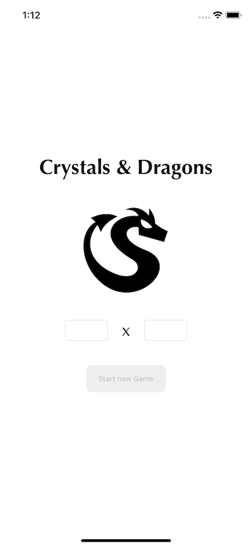

#  Кристаллы и драконы
    
    Игра, где главный герой ходит по лабиринту и ищет клад. Игровой мир представляет собой матрицу MxN комнат, 
    при этом у каждой комнаты есть от 1 до 4 дверей (по сторонам света), через которые можно попасть в смежне комнаты. 
    В каждой комнате может быть несколько игровых объектов, с которыми игрок может взаимодействовать по некоторым 
    игровым правилам. Цель – найти ключ и сундук, открыть сундук ключом и получить священный Грааль.
    
    ​
    ​
